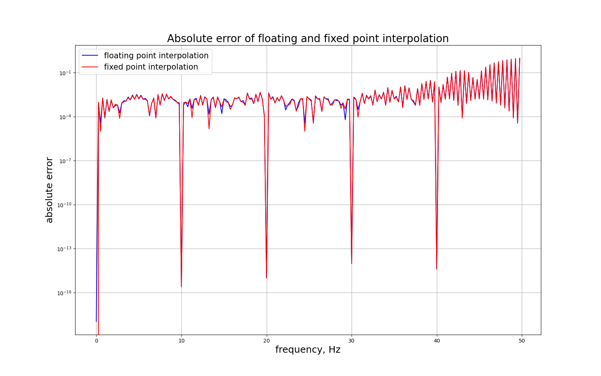
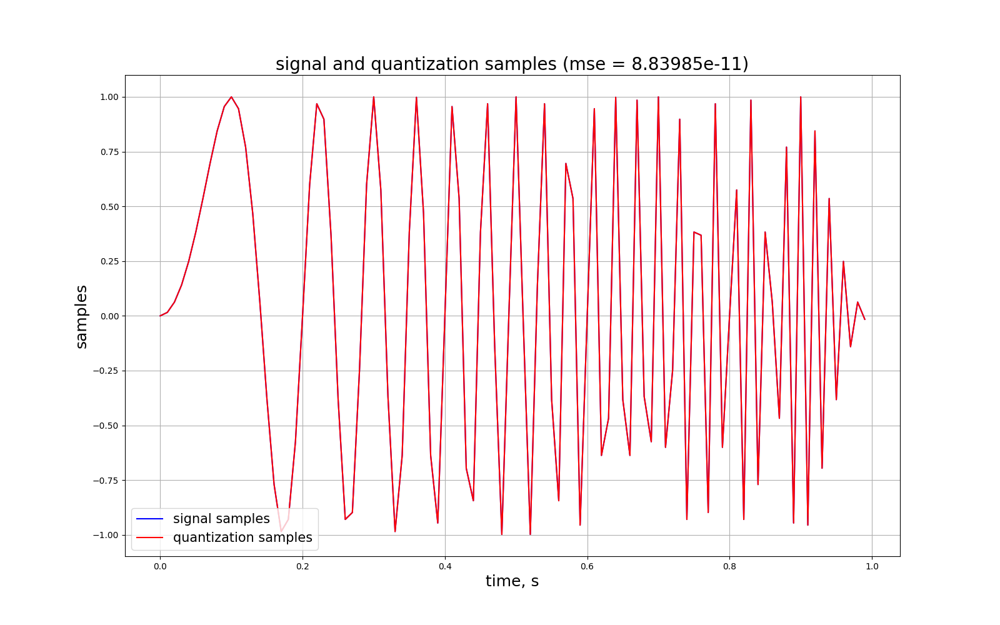
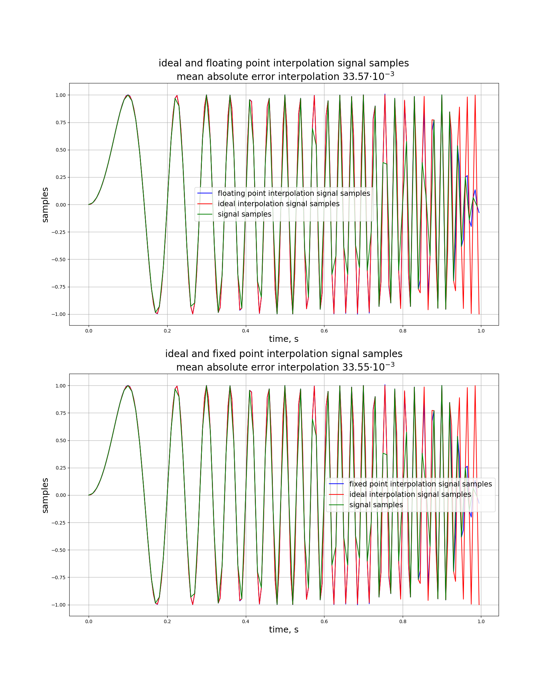
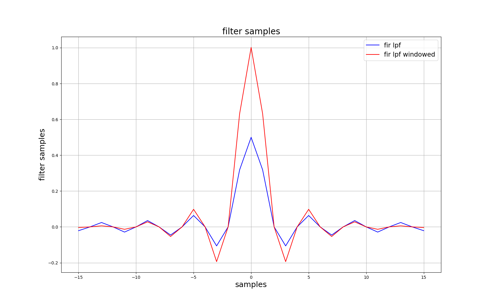

# YADRO DSP

## Структура репозитория

```text
.
├── dsp.cpp
├── dsp.exe
├── plot_results.py
└── .gitignore
```

## Назначение файлов

### `dsp.cpp`

Содержит класс `DSPEngine`, который выполняет основные задачи:

- генерацию синусоидального сигнала с частотой дискретизации 100 Гц и непрерывной фазой для частот от 0 до 50 Гц;
- квантование синуса в плавающей точке к разрядности сетки в 16 бит;
- расчёт ошибки квантования при помощи метрики **MSE**;
- построение КИХ-фильтра низких частот с окном Хэмминга;
- интерполяцию входного воздействия в 2 раза в формате плавающей точки;
- интерполяцию входного воздействия в 2 раза в формате фиксированной точки;
- анализ качества интерполяции сигнала в зависимости от частоты сигнала;
- сохранение данных для дальнейшей визуализации.

Ключевые методы:

- `generate_sin` — генерация синусоидального сигнала;
- `quantization` — квантование синуса;
- `floating_point_interpolation` — интерполяция в формате плавающей точки;
- `fixed_point_interpolation` — интерполяция в формате фиксированной точки;
- `interpolation_abs_error_vs_freq` — расчёт абсолютной ошибки интерполяции в зависимости от частоты сигнала;
- `quantization_mse` — расчёт MSE квантования.

### `dsp.exe`

Скомпилированная версия C++ модуля.

Файл собран под Windows.

### `plot_results.py`

Ключевые методы:

- `plot_interpolation_abs_error_vs_frequency` - построение графика абсолютной ошибки интерполяции в форматах плавающей и фиксированной точках в зависимости от частоты;



- `plot_signal_and_quantization_samples` - визуализация исходного и квантованного сигнала;



- `plot_ideal_and_interpolation_signal` - сравнение интерполированного и идеального сигналов;



- `plot_filter` - визуализация импульсной характеристики КИХ-фильтра низких частот с окном и без окна Хэмминга. ИХ оконного фильтра нормируется и масштабируется.



### `requirements.txt`

Файл с Python-зависимостями.

Сейчас проект использует:

- `matplotlib==3.10.9`

## Математические выкладки

Первая наша задача - создать синусоидальный сигнал $y(t)$ с непрерывно меняющейся фазой $\varphi(t)$ по частоте $f(t)$:

$$
y(t) = \sin{\varphi(t)}, \quad \varphi(t) = 2\pi \int_{0}^{t}f(\tau)\text{d}\tau
$$

Построим $f(t)$. Обозначим количество временных (дискретных) отсчётов по времени $N$ на симуляции длительностью $T$ с частотой дискретизации $f_s$:

$$
N = f_s \cdot T
$$

Дискретизируем частоту:

$$
f_n = f_{\min} + n\Delta f, \quad \Delta f = \frac{f_{\max} - f_{\min}}{N}
$$

То же самое мы можем сделать и со временем:

$$
t = n\Delta t, \quad \Delta t = \frac{1}{f_s} \quad \Rightarrow \quad n = f_st
$$

Имеем:

$$
f(t) = f_{\min} + f_st \cdot \frac{f_{\max} - f_{\min}}{N} =  f_{\min} + (f_{\max} - f_{\min}) \cdot \frac{t}{T}
$$

Тогда $\varphi(t)$:

$$
\varphi(t) = 2\pi \int_{0}^{t}f(\tau)\text{d}\tau = 2\pi t \cdot (f_{\min} + (f_{\max} - f_{\min}) \cdot \frac{t}{2T})
$$

Получаем:

$$
y(t) = \sin{2\pi t \cdot (f_{\min} + (f_{\max} - f_{\min}) \cdot \frac{t}{2T})}
$$

В отсчётах:

$$
y_n = \sin{2\pi \frac{n}{f_s} \cdot (f_{\min} + (f_{\max} - f_{\min}) \cdot \frac{n}{2Tf_s})}
$$

Вторая задача - квантование синуса в плавающей точке к разрядности сетки в 16 бит. Получается, что на отрезок $[-1; \ 1]$ будет всего $2^{16} - 1$ отсчётов.
Тогда:

$$
q_n = round(y_n \cdot (2^{15} - 1)) \in [-32767; \ 32767], \quad \hat{y}_n = \frac{q_n}{2^{15} - 1}
$$

Третья задача - интерполяцию входного воздействия в 2 раза. Введём интерполированный сигнал $x(t)$, частота дискретизации которого в два раза больше частоты дискретизации $y(t)$:

$$
f_s^{new} = 2f_s
$$

Построим $x(t)$, вставляя нули в $y(t)$ на места желаемых отсчётов. После данного действия, спектр исходного сигнала стал в два раза больше, поэтому воспользуемся КИХ-фильтром низких частот с частотой среза:

$$
f_c = \frac{f_s/2}{f_s^{new}}
$$

Коэффициенты КИХ-фильтра низких частот будут иметь следующий вид:

$$
h_n = 2f_c\text{sinc}{2\pi f_cn}, \quad n = -M \ \ldots \ M
$$

где длина фильтра: $L = 2M+1$.

Чтобы избежать пульсации сигнала на краях (эффект Гиббса) воспользуемся оконным преобразованием, а именно оконной функцией Хэмминга:

$$
w_n = 0.54 - 0.46 \cos\left( \frac{2\pi n}{L-1} \right)
$$

Получаем коэффициенты оконного КИХ-фильтра низких частот:

$$
h_n^w = h_n \cdot w_n
$$

После нормируем (для единичного усиления на нулевой частоте) и масштабируем (для компенсации амплитуды при вставке нулей) эти коэффициенты.

## Выводы исследования

Из графика сравнения интерполяционного сигнала и сигнала с частотой дискретизации в два раза больше видно, что ошибка интерполяции возрастает при приближении мгновенной частоты сигнала к частоте Найквиста (50 Гц).
Данное различие можно обосновать тем, что частота Найквиста для исходной частоты дискретизации как раз равна 50 Гц. Соответственно становится сложно восстановить и интерполировать сигнал по изначальным временным отсчётам.
При частоте дискретизации 200 Гц данной проблемы, очевидно, не наблюдается.

Из графика сравнения качества интерполяции в форматах плавающей и фиксированной точек относительно частоты сигнала заметно, что абсолютная ошибка интерполяции практически совпадает.
Данный факт можно объяснить тем, что разрядность сетки (16 бит) даёт высокую точность, поскольку шаг квантования примерно составляет $10^{-5}$, соответственно и погрешность квантования будет такого же порядка.
При амплитуде сигнала 1 данная погрешность незначительна, что и даёт высокую схожесть методов интерполяции.
